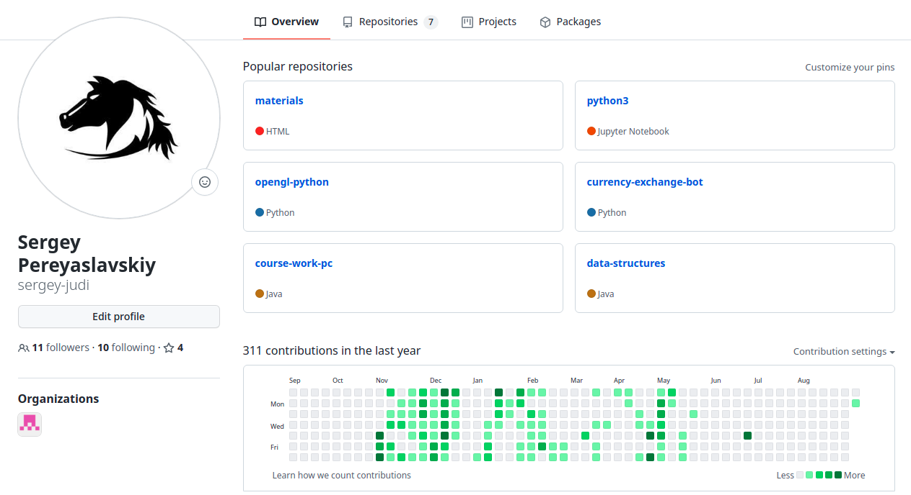
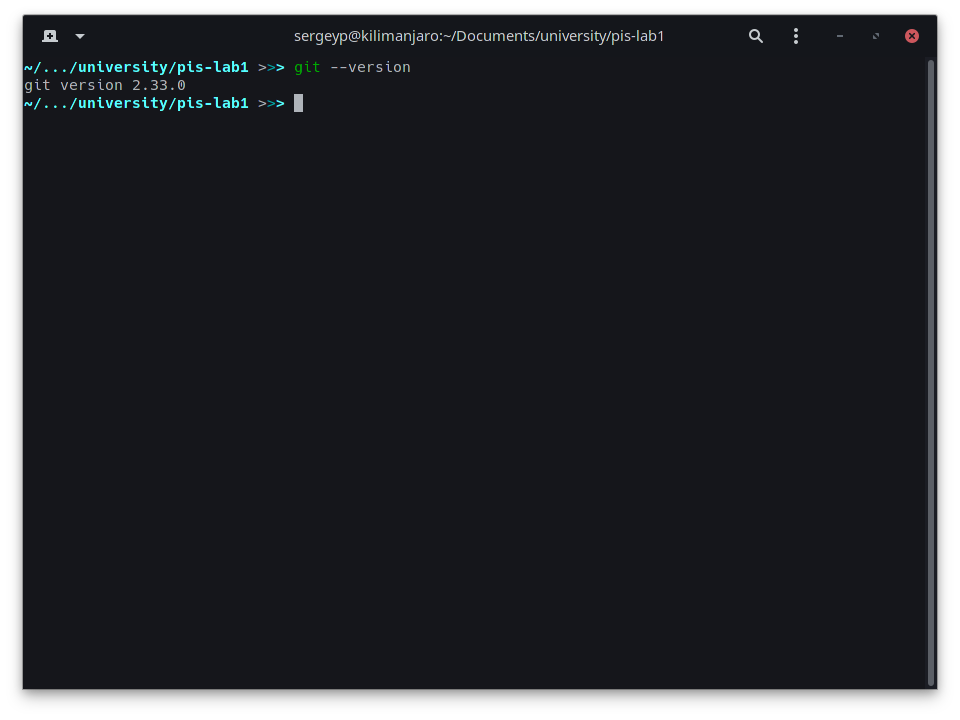
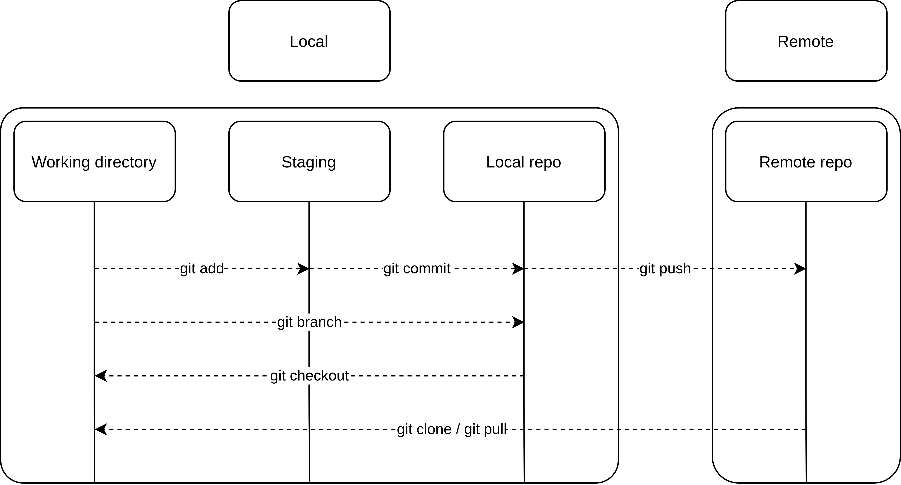
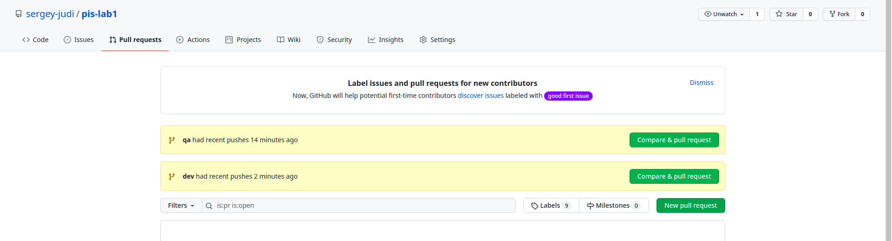
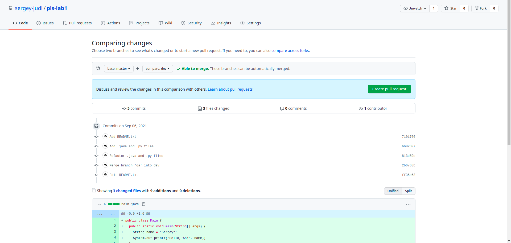
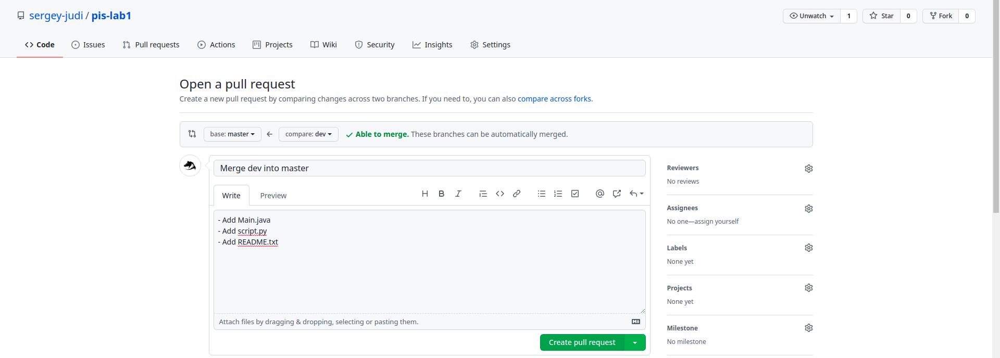
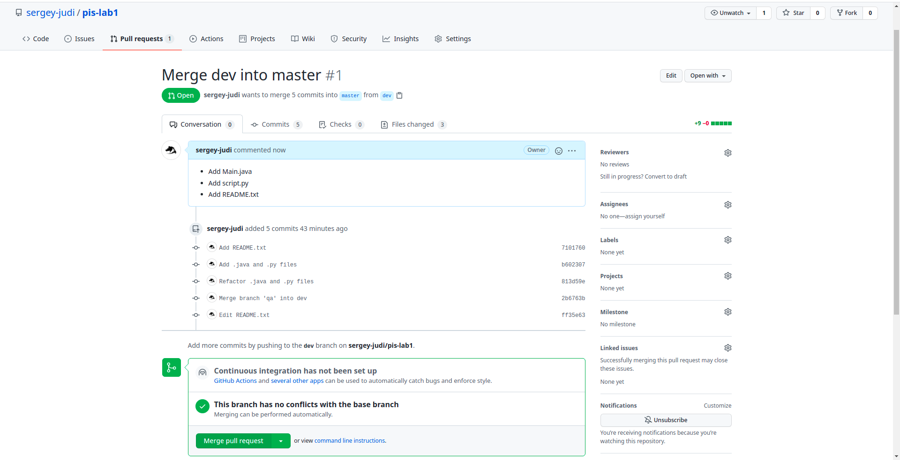
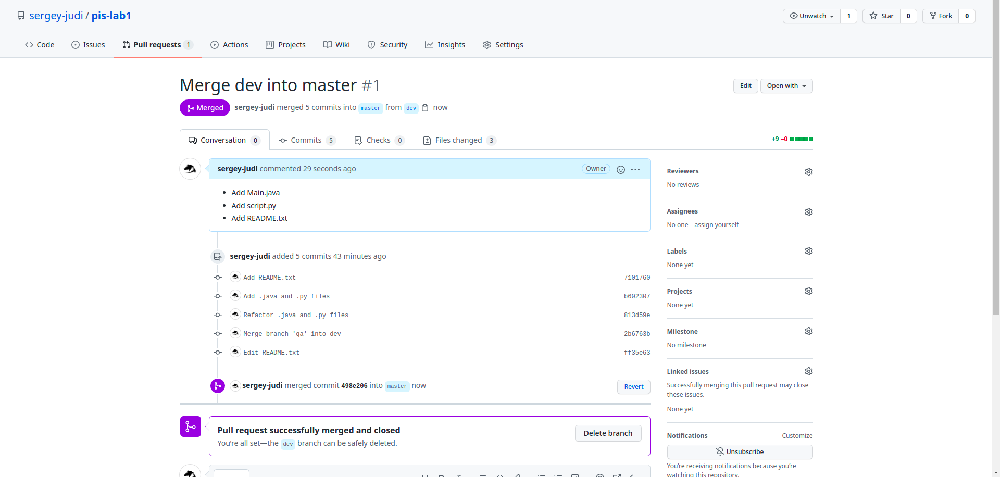

# Лабораторна робота 1

## Мета роботи: за допомогою системи контролю версій завантажити коди програми у репозіторій. Відтворити типовий цикл розробки програмного забезпечення звикористанням системи контролю версій.

### Задачі 
1. Вивчити основні команди роботи з репозіторіями. 
2. Завантажити код програми у репозіторій. 
3. Показати основний цикл роботи з програмним кодом за допомогою системи контролю версій.

### Завдання 1
Обрати безкоштовну систему репозиторія для системи контролю версіями, наприклад github (або інш). Додайте скріншот з вашого створеного акаунту. 



### Завдання 2
Встановити клієнтське безкоштовне програмне забезпечення для роботи с системою контролю версій (GIT clients). Додайте скріншот з встановленим клієнтським програмним забезпеченням GIT (або консольний варіант).



### Завдання 3
Протягом роботи над лабораторними роботами 2-7 використовувати систему контролю версіями.

### Завдання 4
Описати цикл розробки програмного забезпечення з використанням системи контролю версій. Додайте скріншот з діаграмою циклу розробки ПО з системою контролю версій.



## Хід виконання лабораторної роботи

Створіть репозиторій у вашій системі керування версіями. Яку треба застосувати команду git та додайте лістинг виконання команди.

```bash
>>> mkdir pis-lab1 
>>> cd pis-lab1  
>>> git init

```
***
Створіть гілки DEV, QA у вашому репозиторії. Яку треба застосувати команду git та додайте лістинг виконання команди.

```bash
>>> git branch dev
>>> git branch qa
```

***
Завантажте файл README.TXT у репозиторій в гілку DEV. Яку треба застосувати команду git та додайте лістинг виконання команди. 

```bash
>>> git checkout dev
>>> touch README.txt
>>> git add README.txt
>>> git commit -m "Add README.txt"
>>> git push --set-upstream origin dev 
```

***
Завантажте декілька різних файлів до гілки QA. Яку треба застосувати команду git та додайте лістинг виконання команди. 

```bash
>>> git checkout qa 
>>> touch script.py  
>>> touch Main.java 
>>> git add Main.java script.py
>>> git commit -m "Add .java and .py files"
>>> git push --set-upstream origin qa
```

***
Внести зміни до файлів в гілці QA та завантажити зміни в репозиторій. Яку треба застосувати команду git та додайте лістинг виконання команди. 

```bash
>>> git add Main.java script.py
>>> git commit -m "Refactor .java and .py files"
>>> git push
```

***
Об'єднайте тепер гілку DEV з гілкою QA. Яку треба застосувати команду git та додайте лістинг виконання команди.

```bash
>>> git checkout dev
>>> git merge qa
>>> git push
```

***
Покажіть які є гілки в репозиторії на даний момент. Яку треба застосувати команду git та додайте лістинг виконання команди.

```bash
>>> git branch
```

***
Зробити коміт в поточну гілку. Виконати зміну месаджу коміту та відправити зміни у репозиторій. Які треба застосувати команди git та додайте лістинг виконання команди. 

```bash
>>> git add README.txt
>>> git commit -m "README.txt"
>>> git commit --amend -m "Edit README.txt"
>>> git push
```

***
Створіть Pull Request в github. Додайте скріншот виконання команди.









***
Виконайте Merge pull request. Додайте скріншот виконання команди.


